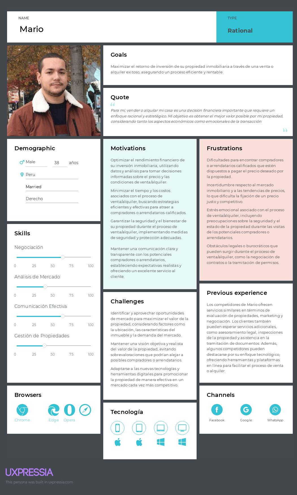
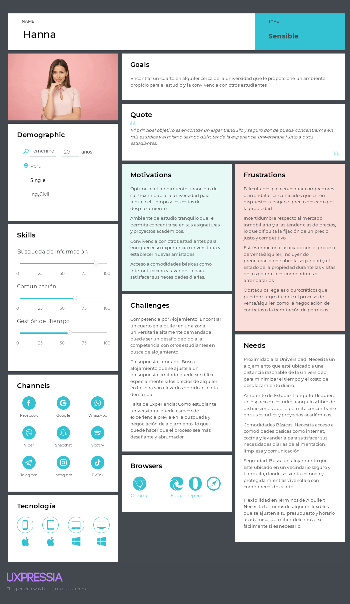

# Capítulo II: Requirements Elicitation & Analysis

## 2.1.Competidores
HomeHeavenly se introduce en el mercado de plataformas digitales inmobiliarias, donde enfrenta la competencia de sitios web establecidos que también facilitan la búsqueda y adquisición de propiedades. A continuación, se describen los competidores directos:

* **Urbania**: Urbania ofrece una plataforma de listados inmobiliarios con una variedad de propiedades para alquiler y venta. Aunque su presencia en el mercado es notable, puede que no ofrezca la misma experiencia de usuario personalizada y las herramientas avanzadas que caracterizan a HomeHeavenly.
* **Adondevivir**: Este portal inmobiliario es conocido por su amplia oferta de propiedades en Perú. Proporciona opciones tanto para compradores como para arrendatarios, pero HomeHeavenly busca diferenciarse mediante una plataforma más intuitiva y un proceso de búsqueda más eficiente.
* **LaEncontre**: LaEncontré es un competidor que ofrece servicios similares de listado de propiedades. Sin embargo, HomeHeavenly se distingue por su enfoque en la personalización y la seguridad en el proceso de búsqueda de viviendas, así como por su misión de proporcionar una experiencia integral y satisfactoria.

Estos competidores representan alternativas en el mercado inmobiliario digital, pero HomeHeavenly se posiciona como una opción innovadora que prioriza la experiencia del usuario y la eficiencia del proceso de búsqueda de propiedades.

### 2.1.1 Análisis Competitivo:

<table>
  <thead>
    <tr>
      <th colspan="6" style="text-align: center">Competitive Analysis Landscape</th>
    </tr>
    <tr>
      <th rowspan="2">¿Por qué llevar a cabo este análisis?</th>
      <th colspan="5">¿Qué es lo que les falta a mis competidores para implementarlo?</th>
    </tr>
      <th colspan="5">¿Qué debo tomar como ejemplo de mis competidores?</th>
    <tr>
      <th colspan="2">Empresa / APP</th>
      <th>MiCasita</th>
      <th>Urbania</th>
      <th>Adondevivir</th>
      <th>LaEncontre</th>
    </tr>
  </thead>
  <tbody>
      <tr>
          <th rowspan="3">Perfil</th>
      <tr>
      <td>Overview</td>
      <td>Plataforma digital innovadora para la búsqueda y adquisición de propiedades.</td>
      <td>Promotora inmobiliaria con transición a plataforma digital.</td>
      <td>Portal inmobiliario con amplia oferta en Perú.</td>
      <td>Servicios de listado de propiedades con enfoque local.</td>
    </tr>
    <tr>
      <td>Ventaja competitiva ¿Qué valor ofrece a los clientes?</td>
      <td>Experiencia personalizada con herramientas avanzadas de búsqueda y seguridad.</td>
      <td>Presencia de mercado establecida y diversificación de servicios.</td>
      <td>Amplia base de usuarios y reconocimiento de marca en Perú.</td>
        <td>Enfoque en la comunidad local y servicios personalizados.</td>
      </tr>
      </tr>
    <tr>
        <th rowspan="3">Perfil de Marketing</th>
        <tr>
      <td>Mercado objetivo</td>
      <td>Usuarios que buscan una experiencia digital integral en la búsqueda de viviendas.</td>
      <td>Compradores y vendedores de propiedades que valoran la experiencia tradicional y digital.</td>
      <td>Público peruano en busca de propiedades para alquilar o comprar.</td>
      <td>Usuarios que prefieren un enfoque local y personal en la búsqueda de propiedades.</td>
    </tr>
    <tr>
      <td>Estrategias de marketing</td>
      <td>Marketing digital, SEO, y colaboraciones con influencers inmobiliarios.</td>
      <td>Publicidad online y offline, presencia en redes sociales.</td>
      <td>Campañas de marketing digital y publicidad en medios locales.</td>
      <td>Estrategias de marketing comunitario y presencia en eventos locales.</td>
    </tr>
    </tr>
    <tr>
    <th rowspan="4">Perfil de Producto</th>
    <tr>
      <td>Productos & Servicios</td>
      <td>Plataforma de búsqueda de viviendas con herramientas de filtrado y comparación.</td>
      <td>Listados inmobiliarios y servicios de promoción de viviendas y oficinas.</td>
      <td>Portal de listados inmobiliarios para compra, venta y alquiler.</td>
      <td>Servicios de listado y asesoramiento inmobiliario.</td>
    </tr>
    <tr>
      <td>Precios y Costos</td>
      <td>Servicios gratuitos con opciones premium para listados destacados.</td>
      <td>Servicios de valoración y asesoramiento con costos variables.</td>
      <td>Acceso gratuito a listados con servicios adicionales de pago.</td>
      <td>Modelos de precios basados en servicios de listado y asesoramiento.</td>
    </tr>
    <tr>
      <td>Canales de distribución (Web y/o Móvil)</td>
      <td>Plataforma web y aplicación móvil.</td>
      <td>Sitio web y oficinas físicas.</td>
      <td>Portal web y aplicación móvil.</td>
      <td>Sitio web y contacto directo con agentes locales.</td>
    </tr>
</tr>
    
    
    
  </tbody>
</table>

    
<table>
  <tbody>
    <tr>
      <th rowspan=10>Análisis SWOT</th>
        <td colspan=2>Realice esto para su startup y sus competidores. Sus fortalezas deberían apoyar sus oportunidades y contribuir a lo que ustedes definen como su posible ventaja competitiva.</td>
        <tr>
      <th>Fortalezas</th>
      <td>
        <ul>
          <li>Experiencia de usuario personalizada. Herramientas avanzadas de búsqueda. Proceso seguro y eficiente.</li>
          <li>Amplia gama de servicios inmobiliarios. Fuerte presencia en el mercado.</li>
          <li>Reconocimiento de marca en Perú. Gran base de listados de propiedades.</li>
          <li>Enfoque local y personalizado. Conexión directa con el mercado inmobiliario.</li>
        </ul>
      </td>
    </tr>
    <tr>
      <th>Debilidades</th>
      <td>
        <ul>
          <li>Menor reconocimiento de marca. Base de usuarios en desarrollo. Dependencia de la tecnología.</li>
          <li>Menos enfocado en la experiencia digital. Puede ser percibido como menos innovador.</li>
          <li>Experiencia de usuario puede ser menos intuitiva. Menos herramientas de personalización.</li>
          <li>Alcance limitado geográficamente. Menos herramientas tecnológicas avanzadas.</li>
        </ul>
      </td>
    </tr>
    <tr>
      <th>Oportunidades</th>
      <td>
        <ul>
          <li>Creciente demanda de soluciones digitales. Potencial de expansión internacional. Innovación continua.</li>
          <li>Expansión de su plataforma digital. Diversificación de servicios.</li>
          <li>Mejora de la plataforma digital. Expansión de servicios y listados.</li>
          <li>Expansión a nuevas áreas geográficas. Mejora de la experiencia digital.</li>
        </ul>
      </td>
    </tr>
    <tr>
      <th>Amenazas</th>
      <td>
        <ul>
          <li>Competencia con empresas establecidas. Cambios tecnológicos rápidos. Riesgos de seguridad cibernética.</li>
          <li>Nuevos entrantes digitales. Cambios en las preferencias del consumidor.</li>
          <li>Competencia de nuevas plataformas más intuitivas. Cambios en el mercado inmobiliario.</li>
          <li>Competidores con mejor tecnología. Cambios en las dinámicas del mercado local.</li>
        </ul>
      </td>
    </tr>
    </tr>
  </tbody>
</table>

    

    
### 2.1.2. Estrategias y tácticas frente a competidores
    
Para mantener una ventaja competitiva y enfrentar eficazmente a nuestros competidores en el mercado de plataformas digitales inmobiliarias, HomeHeavenly implementará las siguientes estrategias y tácticas:
    
* **Marketing y branding diferenciado:** Desarrollaremos una estrategia de marketing sólida que resalte nuestras fortalezas únicas y diferenciadoras, como la experiencia del usuario personalizada y la seguridad del proceso. Utilizaremos tácticas de marketing digital, publicidad en redes sociales y relaciones públicas para aumentar la conciencia de marca y atraer a nuevos usuarios a nuestra plataforma.
* **Innovación tecnológica:** Continuaremos invirtiendo en el desarrollo de tecnologías innovadoras que mejoren la eficiencia y la seguridad del proceso de búsqueda y adquisición de propiedades. Esto podría incluir la implementación de inteligencia artificial para análisis de datos, realidad virtual para visitas virtuales a propiedades y herramientas de seguridad avanzadas para proteger la información del usuario.
* **Colaboraciones estratégicas:** Buscaremos establecer alianzas con agentes inmobiliarios locales, empresas de tecnología y otras partes interesadas clave para ampliar nuestro alcance y mejorar nuestra oferta de servicios. Estas colaboraciones nos permitirán acceder a una mayor cantidad de listados de propiedades y ofrecer servicios adicionales, como asesoramiento legal y financiero, a nuestros usuarios.
* 
## 2.2. Entrevistas

<b>Entrevista numero 1 </b> 

<a href="https://upcedupe-my.sharepoint.com/:v:/g/personal/u20181b152_upc_edu_pe/EagoubvWZvxEkTKSiF5h2MQBWxHvlKJQF-wcgRPYt2B7Gw?e=2mcdcs" target="_blank">Presione aquí para abrir la entrevista</a>

 

Esta parte del informe presentará la parte objetiva de las entrevistas junto con el análisis relevante de cada una de ellas.

    <h3>Segmento #1: Compradores Juveniles</h3>
    
En MiCasita, nos dedicamos a comprender profundamente las necesidades y expectativas de las familias jóvenes y estudiantes universitarios que están en busca de un hogar. Reconocemos que encontrar la vivienda perfecta es un proceso crucial y personal, por lo que nos esforzamos por ofrecer una experiencia de búsqueda de vivienda que sea intuitiva, personalizada y satisfactoria para este segmento de usuarios. Nuestro compromiso con la excelencia se refleja en la creación de un conjunto de preguntas diseñadas específicamente para abordar las diversas necesidades, experiencias y expectativas de las familias jóvenes y estudiantes universitarios en relación con la búsqueda de vivienda. Nos esforzamos por comprender sus preferencias de ubicación, prioridades de seguridad, presupuesto y otros factores importantes que influyen en su decisión de elegir un hogar.

    
<strong>Preguntas principales:</strong>

    <ol>
        <li>¿Cuál es tu nombre, edad y situación actual (familia joven, estudiante universitario, etc.)?</li>
        <li>¿Qué tipo de propiedad estás buscando (apartamento, casa, etc.) y cuáles son tus preferencias de ubicación?</li>
        <li>¿Cuáles son tus principales prioridades al buscar un hogar (precio, seguridad, cercanía a instituciones educativas, etc.)?</li>
        <li>¿Qué herramientas o recursos utilizas actualmente para buscar propiedades?</li>
        <li>¿Cuáles son los mayores desafíos que enfrentas al buscar un hogar y cómo crees que una aplicación podría ayudarte a superarlos?</li>
        <li>¿Qué características te gustaría ver en una aplicación de búsqueda de propiedades para satisfacer tus necesidades específicas?</li>
        <li>¿Qué tipo de información te gustaría poder acceder fácilmente desde una aplicación de búsqueda de propiedades?</li>
        <li>¿Cómo te gustaría organizar y comparar las propiedades que encuentres?</li>
        <li>¿Qué esperas lograr al utilizar una aplicación como MiCasita para encontrar tu próximo hogar?</li>
        <li>¿Qué mejoras esperas ver en el proceso de búsqueda de propiedades al implementar una aplicación como MiCasita?</li>
    </ol>

    <h3>Segmento #2: Propietarios de Inmuebles Independientes</h3>
    
En MiCasita, reconocemos los desafíos únicos que enfrentan los propietarios individuales de bienes raíces al alquilar o vender sus propiedades. Nos comprometemos a proporcionar herramientas y recursos que simplifiquen la gestión y promoción de sus propiedades, garantizando una experiencia exitosa y sin complicaciones. Para lograr esto, hemos desarrollado un conjunto de preguntas diseñadas específicamente para abordar las diversas necesidades, experiencias y expectativas de los propietarios de bienes raíces en relación con la gestión eficiente de sus propiedades y la promoción exitosa de las mismas.

    
<strong>Preguntas principales:</strong>

    <ol>
        <li>¿Cuál es tu nombre, edad y situación actual como propietario de bienes raíces?</li>
        <li>¿Qué tipo de propiedad posees y cuáles son tus objetivos alquilar o vender?</li>
        <li>¿Qué estrategias utilizas actualmente para promocionar tus propiedades y gestionar las consultas de los posibles inquilinos o compradores?</li>
        <li>¿Cuáles son los mayores desafíos que enfrentas como propietario de bienes raíces y cómo crees que una aplicación podría ayudarte a superarlos?</li>
        <li>¿Qué características te gustaría ver en una aplicación de gestión de propiedades para satisfacer tus necesidades específicas?</li>
        <li>¿Qué tipo de información te gustaría poder acceder fácilmente desde una aplicación de gestión de propiedades?</li>
        <li>¿Cómo te gustaría gestionar las solicitudes de visita y el proceso de alquiler o venta a través de una aplicación?</li>
        <li>¿Qué esperas lograr al utilizar una aplicación como MiCasita para gestionar tus propiedades?</li>
        <li>¿Qué mejoras esperas ver en la gestión de tus propiedades al implementar una aplicación como MiCasita?</li>
    </ol>

## 2.2.2. Registro de entrevistas
### Entrevista 1

Screenshot: 

| Nombres | Apellidos | Edad | Distrito | Inicio | Duración |
|---------|-----------|------|--------------|----------|--------|
| Camila Fernanda | Morales Farias |19 | Castilla,Piura |  0:00| 4:35 |

Descripción:
Durante la entrevista, se dialogó con un estudiante en busca de alojamiento para su estadía universitaria. El entrevistado explicó que, para encontrar un cuarto donde quedarse, tuvo que realizar la búsqueda de manera presencial. Esta necesidad surgió debido a la falta de opciones disponibles en línea que se ajustaran a sus necesidades específicas y a la percepción de que la información en línea era insuficiente para evaluar adecuadamente las opciones de alojamiento.

El entrevistado demostró una actitud pragmática y enfocada en encontrar una solución práctica para su necesidad de alojamiento universitario. Se mostró receptivo a explorar diferentes opciones y a adaptarse a las condiciones y limitaciones del mercado de alquiler de viviendas.

En cuanto a tecnología, el entrevistado mencionó que utiliza dispositivos móviles y computadoras portátiles para acceder a información en línea, pero que la búsqueda de alojamiento en línea no fue suficiente para satisfacer sus necesidades específicas en este caso particular.

El entrevistado destacó la importancia de una comunicación clara y directa con los arrendadores durante el proceso de búsqueda y selección de alojamiento. Además, expresó la necesidad de un acceso fácil a la información relevante sobre las propiedades disponibles, incluyendo detalles sobre ubicación, comodidades y precios.

### Entrevista 2

Screenshot: 

| Nombres | Apellidos | Edad | Distrito | Inicio | Duración |
|---------|-----------|------|----------|--------|----------|
| Samantha Allison | Bazalar Saavedra | 18 | Puente Piedra | 4:36 | 7:28 |

Descripción:

Durante la entrevista con Samantha Allison Bazalar Saavedra, se abordó su perspectiva sobre el uso de la aplicación "Mi Casita" para encontrar su próximo hogar. Samantha expresó la importancia de que la aplicación cumpla con sus expectativas y necesidades específicas, las cuales fueron discutidas previamente en la entrevista.

Entre los aspectos primordiales para Samantha se encuentra la adecuación del domicilio a sus necesidades, así como la consideración de la factibilidad del lugar y la calidad de los vecinos, aspectos que influyen significativamente en su experiencia de vivienda. Además, resaltó la relevancia de las referencias de antiguos arrendatarios, ya que estas brindan información valiosa sobre la experiencia previa en el domicilio y el trato con el propietario.

Samantha mostró interés en la posibilidad de calificar las viviendas en la aplicación, sugiriendo un sistema similar al de "cinco estrellas" para evaluar la experiencia general de los arrendadores y sus propiedades.

En resumen, Samantha enfatizó la importancia de que la aplicación "Mi Casita" satisfaga sus necesidades específicas y brinde una experiencia de búsqueda de vivienda completa y confiable, que incluya información detallada, referencias verificadas y la posibilidad de evaluar y compartir experiencias.

Screenshot: 

| Nombres | Apellidos | Edad | Distrito | Inicio | Duración |
|---------|-----------|------|----------|--------|----------|
| Alfredo | Medina | 23 | Comas | 4:36 | 4:51 |

Descripción:
Durante la entrevista Alfredo Medina nos hace saber que consideraría usar una aplicación como MiCasita si es que está presenta los features que otros medios similares que usa no tiene. 

A su vez, nos hace saber que tiene en mente usar la aplicación si es que llega al lanzarse debido a la necesidad de vivienda que posee ahora mismo.

En resumen, Alfredo Medina nos comentó lo que desea ver en la aplicación y nos explicó su situación y como le ayudaría una aplicación como Micasita que incluya información verificada y visitas a las viviendas.

## 2.2.3. Análisis de entrevistas
Después de acontecer y describir los registros de los entrevistados, en esta sección, se desarrollará una estrategia conjunta que permitirá al equipo identificar ciertos aspectos y/o puntos en común que se tuvo como respuesta ante cada pregunta realizada al entrevistado. Esto mismo, nos sirve a nosotros para tener una visión más analítica y concreta acerca de como se deberá desarrollar la aplicación.

**Segmento 1: Evento del User**
 
* ¿Qué tipo de propiedad estás buscando (apartamento, casa, etc.) y cuáles son tus preferencias de ubicación? 

Según el 70% de posibles compradores nuestros entrevistados suelen buscar como primera opción el apartamento, y posteriormente con más estabilidad económica conseguir una casa propia.  

* ¿Cuáles son tus principales prioridades al buscar un hogar (precio, seguridad, cercanía a instituciones educativas, etc.)?

Segun el 90%, nuestros users valoran el precio de la propiedad y la ubicación en donde esté, ya que está ultima les brinda seguridad.

* ¿Qué herramientas o recursos utilizas actualmente para buscar propiedades?

El 60% de nuestros users buscan por páginas de facebook, buscando a los alrededores de su actual vivienda, por comentarios de amistades y como ultima opción pagínas especializadas en internet.

* ¿Qué características te gustaría ver en una aplicación de búsqueda de propiedades para satisfacer tus necesidades específicas?

El 60% de nuestros users desean tener un filtro acerca de la cantidad de habitaciones, si tiene estacionamiento cerca o en la propiedad y el precio. 

**Segmento 2: Evento del Seller**

* ¿Qué estrategias utilizas actualmente para promocionar tus propiedades y gestionar las consultas de los posibles inquilinos o compradores?

El 65% de los vendedores solo pasan la voz a amistades o conocidos, colocan pancartas con el número de contacto del vendedor y el 15% usan agencias de bienes raices

* ¿Qué tipo de propiedad posees y cuáles son tus objetivos alquilar o vender?

El 70% de los vendedores actualmente poseen propiedades para alquilar como lo son apartamentos o cuartos pequeños.

* ¿Qué tipo de información te gustaría poder acceder fácilmente desde una aplicación de gestión de propiedades?

El 30% de los vendedores desean ver notificicaiones acerca del estado de la propiedad, así como los comentarios de los usuarios que alquilan.
  
* ¿Qué esperas lograr al utilizar una aplicación como MiCasita para gestionar tus propiedades?

El 100% de los vendedores esperan que con la aplicación logren vender o alquilar las propiedades que actualmente no les genera ingresos.

### 2.3 Needfinding

En esta sección se presentan los procesos de análisis de la información recopilada de nuestros segmentos objetivos. Se incluyen las secciones de User Personas, User Task Matrix, User Journey Mappin,  y As-Is Scenario Mapping. 

### 2.3.1. User Personas

A continuación, presentaremos las user personas recopiladas durante nuestras entrevistas, las cuales nos brindan una comprensión más profunda del segmento objetivo al que nos dirigimos. Mediante el análisis de preferencias, comportamientos y herramientas utilizadas, hemos delineado perfiles detallados que nos ayudarán a comprender mejor las necesidades y deseos de nuestros usuarios. Estas user personas son fundamentales para guiar nuestras estrategias de desarrollo y diseño, asegurándonos de que nuestras soluciones satisfagan de manera efectiva las demandas de nuestra audiencia objetivo.

 

### 2.3.2. User Task Matrix
En esta sección, se analizarán las tareas relevantes para dos segmentos de usuarios considerados: Mario Pérez, propietario de casa; y Hanna Rojas, estudiante universitaria. Se identificarán las tareas específicas que estas personas podrían llevar a cabo en relación con la búsqueda o el alquiler de una vivienda. A continuación, se presenta un cuadro que detalla la frecuencia e importancia de cada tarea para cada User Persona.

| Tarea                                                       | Mario Pérez (Propietaria de Casa) | Hanna Rojas (Estudiante Universitaria) |
|-------------------------------------------------------------|----------------------------------------|----------------------------------------|
| Poner y ver  carteles de alquiler y publicidad en folletos   | Alta frecuencia, Importancia alta     | Alta frecuencia, Importancia alta     |
| Buscar por la zona casas que puedan estar en ventas o alquiler       | Alta frecuencia, Importancia alta      | Alta frecuencia, Importancia alta      |
| Buscar casas en alquiler                                   | Media frecuencia, Importancia alta     | Alta frecuencia, Importancia alta      |
| Inspeccionar propiedades                                    | Media frecuencia, Importancia media    | Media frecuencia, Importancia media    |
| Contactar propietarios o agentes inmobiliarios             | Media frecuencia, Importancia alta     | Alta frecuencia, Importancia alta      |
| Visitar propiedades en persona                             | Baja frecuencia, Importancia baja     | Alta frecuencia, Importancia alta      |
| Revisar y comparar precios y condiciones                   | Alta frecuencia, Importancia alta      | Alta frecuencia, Importancia alta      |
| Llamar por teléfono a propietarios o agentes inmobiliarios | Baja frecuencia, Importancia baja      | Alta frecuencia, Importancia alta      |
| Preguntar a conocidos o vecinos sobre casas en alquiler    | Baja frecuencia, Importancia baja      | Media frecuencia, Importancia baja     |

La tarea más importante para Mario Pérez, propietario, y Hanna Vargas, estudiante universitaria, es "Buscar por la zona casas que puedan estar en ventas o alquiler". Esta tarea adquiere una alta frecuencia e importancia para ambos, pero con objetivos diferentes.

Para Mario Pérez, la búsqueda de propiedades en venta o alquiler en la zona es crucial debido a su estrategia competitiva. Mario busca adelantarse a sus competidores, identificando oportunidades de alquiler o venta antes que estos lo hagan. Por lo tanto, la frecuencia e importancia de esta tarea son altas, ya que afecta directamente la rentabilidad y competitividad de su negocio inmobiliario.

Por otro lado, para Hanna Vargas, la importancia de esta tarea radica en asegurar un alojamiento adecuado para sus estudios universitarios. Hanna busca un lugar tranquilo, seguro y cercano a la universidad para poder concentrarse en sus estudios y tener fácil acceso a las instalaciones académicas. Dado que la ubicación y la calidad del alojamiento son fundamentales para su bienestar y rendimiento académico, esta tarea tiene alta frecuencia e importancia para ella.

### 2.3.3. User Journey Mapping

### 2.3.4 Emphaty Mapping
**Compradores Juveniles - Hanna Rojas**

**Propietarios de Inmuebles Independientes - Mario Pérez**

### 2.3.5 As-Is Scenario Mapping
**Compradores Juveniles - Hanna Rojas**

**Propietarios de Inmuebles Independientes - Mario Pérez**

# 2.4 Ubiquitous Language:

| Término            | Definición                                                                                     |
|--------------------|------------------------------------------------------------------------------------------------|
| Property           | Se refiere a una pieza de bienes raíces, incluyendo tierra, edificios y recursos naturales.   |
| Lease              | Contrato entre un propietario y un inquilino que otorga al inquilino el derecho de uso.       |
| Rental Agreement   | Acuerdo legalmente vinculante entre un propietario y un inquilino que describe los términos.    |
| Tenant             | Persona o entidad que alquila una propiedad de un propietario a cambio de pagos de alquiler.   |
| Landlord           | Dueño de una propiedad que la alquila a un inquilino a cambio de pagos de alquiler.            |
| Listing            | Anuncio o descripción de una propiedad disponible para alquilar o vender.                     |
| Real Estate Agent  | Profesional que representa a compradores o vendedores en transacciones inmobiliarias.           |
| Broker             | Profesional que actúa como intermediario en transacciones inmobiliarias.                       |
| Mortgage           | Préstamo utilizado para financiar la compra de bienes raíces.                                  |
| Down Payment       | Pago inicial realizado por un comprador al adquirir una propiedad.                              |
| Closing Costs      | Gastos incurridos por compradores y vendedores durante el cierre de una transacción.           |

