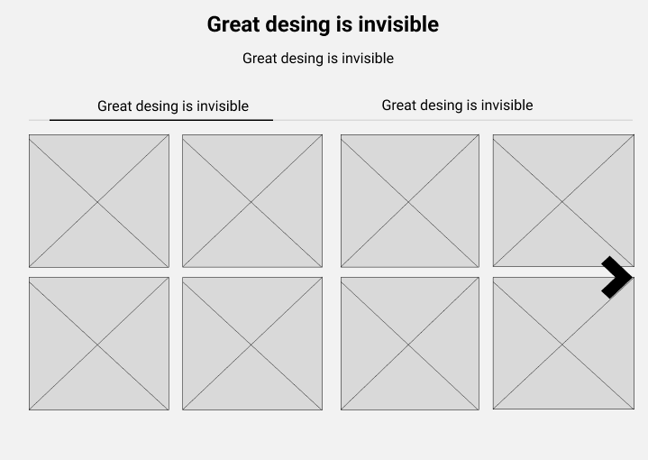
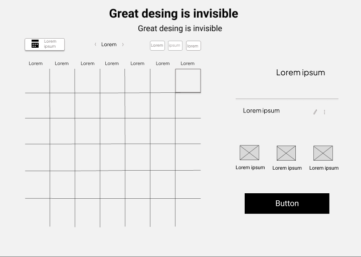
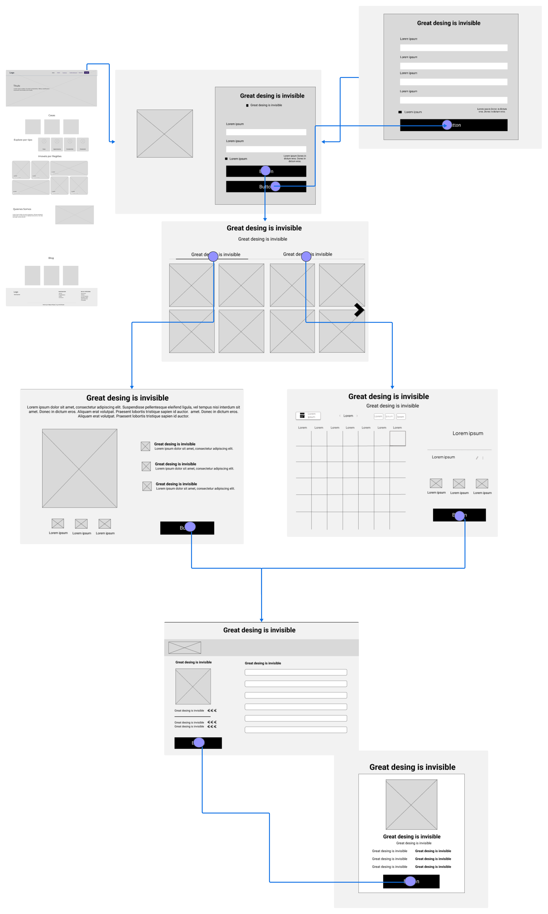
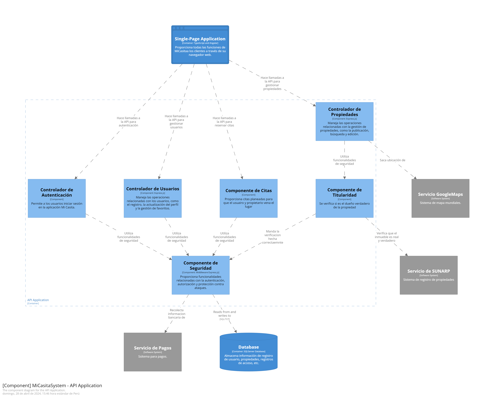

# Capítulo IV: Product Design

## 4.1. Style Guidelines
Las Style Guidelines son fundamentales para mantener una comunicación cohesiva y profesional en todos los aspectos de la marca o proyecto, ya sea en publicaciones impresas, en línea o en cualquier otro medio de difusión. En esta sección estableceremos el conjunto de directrices que usará nuestro equipo para diseñar el proyecto MiCasita. En estas pautas definiremos aspectos como la elección de colores, tipografía, estructura del documento, entre otros elementos. Por ello, para el diseño de Micasita emplearemos la plataforma Figma para la creación de la aplicación web y la página de inicio. En ambas, se incluirá una paleta de colores con tonalidades de morado y blanco , que reflejen la naturaleza y la confianza asociadas con los alquileres de casas . A continuación, se presenta un detalle más amplio de cada aspecto mencionado.

### 4.1.1. General Style Guidelines 
**Branding:** El logotipo de nuestro startup es mucho más que una simple imagen; es la manifestación visual de nuestra identidad. En el centro, el símbolo único que nos representa es nuestro nombre, que se basa en fusionar las palabras donaciones y finanzas, fusiona estas dos palabras, debido a que nuestro startup, es una aplicación de búsqueda de alquiler/ venta para universitarios que buscan un lugar donde vivir en su ciclo escolar. Este logotipo es versátil y se adapta a una variedad de plataformas y aplicaciones, asegurando que nuestra marca se destaque en cualquier entorno. Este logo refleja la transparencia y seguridad que queremos transmitir a loscompradores juveniles y propietarios.

    

    

<b> Horizontal layout </b> 

    

     
    

<b>Inverted Colors</b> 

    

     
    

<b>Logo mark only</b> 

**Typography**

La tipografía de Micasita encapsula la esencia de nuestra innovadora startup, que busca revolucionar el proceso de gestión y cuidado de animales para consumo en Perú. Con un estilo moderno, ordenado y minimalista, se alinea perfectamente con la imagen que deseamos proyectar: una plataforma fácil de usar y confiable para la gestión de animales. Nuestra elección de tipografía refleja nuestro compromiso con la simplicidad y la accesibilidad, utilizando un lenguaje casual y sencillo que invita a nuestros usuarios a sentirse cómodos y empoderados al utilizar nuestra aplicación.

**Tipos de letras a usar:**

- **Roboto slab:** Para el logo de nuestro proyecto.

     
    

 

- **Poppins (encabezados):** Poppins es una tipografía moderna y legible que puede ser ideal para los encabezados y títulos de su plataforma. Transmite confianza y es fácil de leer en pantallas digitales.

     
    

 

- **Noto Sans (cuerpo de texto):** Noto Sans es una tipografía versátil que funciona bien para el cuerpo de texto en su plataforma. Su calidad ayudará a que la información sea fácil de absorber.

     
    

 

- **Roboto (botones):** Roboto es una tipografía limpia que puede funcionar bien para los botones y llamados a la acción. Ayuda a crear un aspecto moderno y atractivo que alienta a los usuarios a participar.

     
    

 

- **Raleway (detalles):** Raleway puede usarse para resaltar detalles importantes o elementos de diseño. Su aspecto contemporáneo y elegante puede añadir un toque de sofisticación a su plataforma.

     
    

 

- **Arial (texto legal y pie de página):** Para el texto legal y el pie de página, Arial es una elección segura. Es altamente legible y transmite profesionalismo.

     
    

 

**Colors**

La selección de colores en MiCasita se ha llevado a cabo de manera estratégica, utilizando una paleta que refleja nuestra visión y valores. Los tonos #34216b, #ebe7f3 y #d854a5 han sido elegidos meticulosamente para transmitir la esencia de nuestra innovadora plataforma de gestión de alquiler/venta. Estos colores no solo crean una armonía visual, sino que también establecen un equilibrio entre la venta de los inmuebles(representada por el morado), la integridad (encarnada en el tono fucsia claro) y la transparencia (reflejada en el blanco puro). Esta combinación refuerza nuestra identidad como una solución moderna y confiable en el ámbito de los alquileres de la gestión de propiedades, destacándose por nuestra singularidad y compromiso con el bienestar universitario y la eficiencia en la búsqueda de casas.

**Gama de colores:**

<b>#34216b</b> 

     
    

 

<b>#ebe7f3</b> 

     
    

 

<b>#d854a5</b> 

     
    

 

**Spacing**

El espaciado ideal en la plataforma web de Micasita, dedicada a la gestión de animales, debe priorizar la legibilidad y la comodidad del ganadero.

Para una Plataforma Web:

- **Espaciado entre líneas (line-height):**
  - Texto de cuerpo: 1.4 a 1.6 veces el tamaño de la fuente.
- **Espaciado entre párrafos:**
  - Margen inferior de al menos el 120% del tamaño de fuente entre párrafos.
- **Margen y espaciado alrededor de elementos de la interfaz:**
  - Al menos 20 píxeles de espacio entre elementos de la interfaz.
- **Espaciado entre secciones o módulos:**
  - Margen superior e inferior de al menos 45 píxeles.
- **Espaciado entre elementos de menú y navegación:**
  - Al menos 15 píxeles de espacio entre elementos de navegación.
- **Espaciado alrededor de imágenes y gráficos:**
  - Al menos 20 píxeles de margen alrededor de las imágenes.
- **Espaciado en el pie de página:**
  - Margen superior e inferior de alrededor de 40 a 60 píxeles.

**Lenguaje y tono de la comunicación**

El tono de comunicación y lenguaje ideal para MiCasita, nuestra aplicación de búsqueda de propiedades inmobiliarias, se caracteriza por ser acogedor, comprensivo, claro y comprometido. En MiCasita, estamos dedicados a transformar la experiencia de búsqueda y adquisición de viviendas, haciendo que sea fácil, seguro y satisfactorio para todos nuestros usuarios. Creemos firmemente en la importancia de establecer una conexión emocional con quienes buscan su próximo hogar y en comunicar de manera efectiva nuestro compromiso con la transparencia y la satisfacción del cliente en el proceso de búsqueda de vivienda. Nuestro tono es amigable y accesible, reflejando nuestra misión de proporcionar una experiencia completa y personalizada en la búsqueda de viviendas. Nos esforzamos por diseñar nuestra plataforma de manera intuitiva y fácil de usar, especialmente para aquellos que pueden no estar familiarizados con la tecnología inmobiliaria.

### 4.1.2. Web Style Guidelines 
Nuestro enfoque en las "Web Style Guidelines" se centra en la creación de una experiencia de usuario consistente y atractiva en entornos de navegación web. Esto implica el uso de una paleta de colores cohesiva, tipografía legible y un diseño responsivo que se adapte a una variedad de dispositivos y tamaños de pantalla.
 

## 4.2. Information Architecture

#### 4.2.1. Organization Systems
El sistema de organización dentro de la plataforma de MiCasita está diseñado para agilizar el proceso de búsqueda y adquisición de propiedades. Las propiedades se categorizan según diversos factores como la ubicación, el tipo (por ejemplo, apartamento, casa), el tamaño, las comodidades y el rango de precios. Esta organización estructurada garantiza que los usuarios puedan navegar fácilmente por la plataforma y encontrar propiedades que se ajusten a sus criterios específicos.

| Característica            | Descripción                                                  |
|---------------------------|--------------------------------------------------------------|
| Categorización            | Ubicación, tipo de propiedad, tamaño, comodidades, precio    |
| Estructura                | Jerárquica y fácil de seguir                                 |
| Facilidad de Navegación   | Menús claros y opciones intuitivas                            |

#### 4.2.2. Labeling Systems
El sistema de etiquetado utilizado por MiCasita asegura claridad y consistencia en toda la plataforma. Las propiedades se etiquetan con títulos descriptivos que representan con precisión sus características y atributos clave. Además, se utilizan etiquetas para categorizar aún más las propiedades según criterios de búsqueda comunes, facilitando que los usuarios descubran listados relevantes.

| Característica            | Descripción                                                  |
|---------------------------|--------------------------------------------------------------|
| Títulos Descriptivos      | Representan las características clave de las propiedades     |
| Etiquetas Relevantes      | Categorizan propiedades según criterios de búsqueda comunes  |
| Consistencia              | Etiquetado uniforme para una experiencia coherente           |

#### 4.2.3. SEO Tags and Meta Tags 
MiCasita utiliza etiquetas SEO y metaetiquetas para mejorar su visibilidad y clasificación en los resultados de búsqueda de los motores de búsqueda. Estas etiquetas se incorporan estratégicamente en los listados de propiedades, asegurando que sean fácilmente descubribles por los usuarios que buscan palabras clave o frases relacionadas con bienes raíces. Al optimizar las etiquetas SEO y metaetiquetas, MiCasita tiene como objetivo atraer más tráfico orgánico a su plataforma.

Las etiquetas SEO y metaetiquetas se utilizan estratégicamente para mejorar la visibilidad de MiCasita en los motores de búsqueda. Incluyen:

* **Etiquetas de Título** (Title Tags): Contienen el nombre de "MiCasita" y palabras clave relevantes para propiedades inmobiliarias.
* **Meta Descripciones:** Breve descripción que destaca los servicios de MiCasita y su compromiso con la innovación en la búsqueda de propiedades.
* **Metaetiquetas de Palabras Clave:** Incluyen términos relacionados con bienes raíces y la plataforma de búsqueda de MiCasita.
* **Etiquetas de Encabezado (Header Tags):** Utilizan "MiCasita" en encabezados relevantes para mejorar la visibilidad y legibilidad.

**Instrucciones para encontrar rápidamente "MiCasita" en los buscadores:**

1. Utiliza palabras clave específicas como "MiCasita búsqueda propiedades", "MiCasita plataforma inmobiliaria", etc.
1. Incluye el nombre de la ciudad o región si estás buscando propiedades en una ubicación específica.
1. Visita directamente el sitio web de MiCasita escribiendo "MiCasita" en la barra de direcciones del navegador.

#### 4.2.4. Searching Systems
El sistema de búsqueda implementado por MiCasita es robusto y fácil de usar, permitiendo a los usuarios encontrar eficientemente propiedades que satisfagan sus criterios específicos. Las opciones de filtrado avanzadas permiten a los usuarios refinar sus resultados de búsqueda en función de factores como la ubicación, el precio, el número de habitaciones y las comodidades.
 \
**Botón Morado:** Nos lleva al apartado de comentarios para ver las reviews.\
**Botón Rosa:** Nos dirige a las casas para su compra o alquiler.

#### 4.2.5. Navigation Systems 
La navegación dentro de la plataforma de MiCasita es intuitiva y fluida, garantizando una experiencia de usuario positiva. Un menú claro y bien estructurado permite a los usuarios navegar fácilmente entre diferentes secciones de la plataforma, incluidos los listados de propiedades, las búsquedas guardadas y la configuración de la cuenta. Además, las migas de pan y las barras de navegación proporcionan a los usuarios indicaciones contextuales, ayudándoles a comprender su ubicación actual dentro de la plataforma y facilitando la navegación entre páginas.

Al implementar componentes efectivos de arquitectura de la información como sistemas de organización, sistemas de etiquetado, etiquetas SEO y metaetiquetas, sistemas de búsqueda y sistemas de navegación, MiCasita tiene como objetivo proporcionar a los usuarios una experiencia fluida y eficiente a lo largo de su búsqueda de propiedades.

## 4.3. Landing Page UI Design
El diseño de la Landing Page en MiCasita reviste una importancia clave al abordar desafíos como generar confianza, comunicar de manera clara la misión de la plataforma, captar potenciales compradores y ofrecer contenido persuasivo. Esta página mantiene un estilo sencillo, con llamados a la acción evidentes, asegurando que los visitantes comprendan la propuesta de valor de MiCasita y se sientan motivados a explorar las opciones de vivienda con mayor comodidad y facilidad.
Se implementarán diferentes diseños correspondientes a Landing Page Wireframe y Mock-up, siguiendo el esquema de diseño de interfaz de low-res (baja-resolución) a high-res (alta-resolución). En Wireframe, se mostrará el nivel de componentes, incluyendo la ubicación del logo, imágenes, texto y demás elementos, teniendo en cuenta el esquema de colores. En Mock-up, se presentará la interfaz en el nivel de estilos, permitiendo apreciar el texto, imágenes y botones correspondientes al diseño de alta fidelidad (high-fidelity).

### 4.3.1. Landing Page Wireframe 

## Home

 

## Sobre Nostros

 

## Centro de Ayuda

 

## Contactanos

### 4.3.2. Landing Page Mock-up 
## Home

 

## Sobre Nostros

 

## Centro de Ayuda

 

## Contactanos

## 4.4. Web Applications UX/UI Design
### 4.4.1. Web Applications Wireframes 

<table>
  <tr>
    <td>Vista para Usuario</td>
  </tr>
  <tr>
    <td>Segmento de inicio:</td>
  </tr>
  <tr>
    <td></td>
  </tr>
  <tr>
    <td></td>
  </tr>
  <tr>
    <td></td>
  </tr>
  <tr>
    <td>Segmento de casas que se encuentran para su compra o para su alquiler:</td>
  </tr>
  <tr>
    <td></td>
  </tr>
  <tr>
    <td>Segmento para la compra de la casa:</td>
  </tr>
  <tr>
    <td></td>
  </tr>
  <tr>
    <td>Segmento para el alquiler de la casa, en este apartado podrá escoger el intervalo del tiempo para su alquiler:</td>
  </tr>
  <tr>
    <td></td>
  </tr>
  <tr>
    <td>Segmento para poder realizar su compra o alquiler de su casa:</td>
  </tr>
  <tr>
    <td></td>
  </tr>
  <tr>
    <td></td>
  </tr>
</table>

LINK DEL FIGMA: <a href="https://www.figma.com/file/4fyCfSO34q2tOfYMueKWB4/OPEN-SOURCE?type=design&node-id=0%3A1&mode=design&t=5bDnNDbJ5UvSsO9a-1">https://www.figma.com/file/4fyCfSO34q2tOfYMueKWB4/OPEN-SOURCE?type=design&node-id=0%3A1&mode=design&t=5bDnNDbJ5UvSsO9a-1</a>

<table>
  <tr>
    <td>Vista para Vendedor</td>
  </tr>
  <tr>
    <td>Segmento de inicio, una vez creada su cuenta lo va a dirigir a la página para crear su publicación de la venta:</td>
  </tr>
  <tr>
    <td></td>
  </tr>
  <tr>
    <td></td>
  </tr>
  <tr>
    <td></td>
  </tr>
  <tr>
    <td>Segmento de creación de la publicación de la casa, se podrá crear la casa y detallarlo de manera precisa para su venta:</td>
  </tr>
  <tr>
    <td></td>
  </tr>
  <tr>
    <td></td>
  </tr>
  <tr>
    <td></td>
  </tr>
</table>

LINK DEL FIGMA: <a href="https://www.figma.com/file/4fyCfSO34q2tOfYMueKWB4/OPEN-SOURCE?type=design&node-id=0%3A1&mode=design&t=5bDnNDbJ5UvSsO9a-1">https://www.figma.com/file/4fyCfSO34q2tOfYMueKWB4/OPEN-SOURCE?type=design&node-id=0%3A1&mode=design&t=5bDnNDbJ5UvSsO9a-1</a>

### 4.4.2. Web Applications Wireflow Diagrams 
**User Persona: Usuario**  
**User Goal:** Encontrar las casas para su compra o su alquiler según sea necesario para el usuario.

En el Wireflow se evidencia el proceso por el cual debe pasar el usuario general para poder hacer la compra o alquilar la casa, desde la elección de la casa si es para su compra o alquiler, hasta la elección del método de pago.

**User Persona: Vendedor**  
**User Goal:** Crear una publicación de una casa y proporcionar los detalles de este satisfactoriamente.

En el Wireflow se evidencia el proceso por el cual debe pasar el vendedor para crear su casa, desde especificar si la casa es para su compra o para su alquiler.

Link del LucidChart: <a href="https://lucid.app/lucidspark/a59d185c-e4cd-449f-b417-5007714bd05e/edit?viewport_loc=-6600%2C-4600%2C24000%2C11988%2C0_0&invitationId=inv_388d3bdd-5cab-40f8-abea-9590c1f0657b">https://lucid.app/lucidspark/a59d185c-e4cd-449f-b417-5007714bd05e/edit?viewport_loc=-6600%2C-4600%2C24000%2C11988%2C0_0&invitationId=inv_388d3bdd-5cab-40f8-abea-9590c1f0657b</a>

### 4.4.3. Web Applications Mock-ups
<table>
  <tr>
    <td>Vista para Usuario</td>
  </tr>
  <tr>
    <td>Segmento de inicio:</td>
  </tr>
  <tr>
    <td></td>
  </tr>
  <tr>
    <td></td>
  </tr>
  <tr>
    <td>Segmento de casas que se encuentran para su compra o para su alquiler:</td>
  </tr>
  <tr>
    <td></td>
  </tr>
  <tr>
    <td>Segmento para la compra de la casa:</td>
  </tr>
  <tr>
    <td></td>
  </tr>
  <tr>
    <td>Segmento para el alquiler de la casa, en este apartado podrá escoger el intervalo del tiempo para su alquiler:</td>
  </tr>
  <tr>
    <td></td>
  </tr>
  <tr>
    <td>Segmento para poder realizar su compra o alquiler de su casa:</td>
  </tr>
  <tr>
    <td></td>
  </tr>
  <tr>
    <td></td>
  </tr>
</table>

LINK DEL FIGMA: <a href="https://www.figma.com/file/4fyCfSO34q2tOfYMueKWB4/OPEN-SOURCE?type=design&node-id=0%3A1&mode=design&t=5bDnNDbJ5UvSsO9a-1">https://www.figma.com/file/4fyCfSO34q2tOfYMueKWB4/OPEN-SOURCE?type=design&node-id=0%3A1&mode=design&t=5bDnNDbJ5UvSsO9a-1</a>

<table>
  <tr>
    <td>Vista para Vendedor</td>
  </tr>
  <tr>
    <td>Segmento de inicio, una vez creada su cuenta lo va a dirigir a la página para crear su publicación de la venta:</td>
  </tr>
  <tr>
    <td></td>
  </tr>
  <tr>
    <td></td>
  </tr>
  <tr>
    <td>Segmento de creación de la publicación de la casa, se podrá crear la casa y detallarlo de manera precisa para su venta:</td>
  </tr>
  <tr>
    <td></td>
  </tr>
  <tr>
    <td></td>
  </tr>
  <tr>
    <td></td>
  </tr>
</table>

LINK DEL FIGMA: <a href="https://www.figma.com/file/4fyCfSO34q2tOfYMueKWB4/OPEN-SOURCE?type=design&node-id=0%3A1&mode=design&t=5bDnNDbJ5UvSsO9a-1">https://www.figma.com/file/4fyCfSO34q2tOfYMueKWB4/OPEN-SOURCE?type=design&node-id=0%3A1&mode=design&t=5bDnNDbJ5UvSsO9a-1</a>

### 4.4.4. Web Applications User Flow Diagrams

**User Persona: Usuario**  
**User Goal:** Encontrar las casas para su compra o su alquiler según sea necesario para el usuario.

En el Wireflow se evidencia el proceso por el cual debe pasar el usuario general para poder hacer la compra o alquilar la casa, desde la elección de la casa si es para su compra o alquiler, hasta la elección del método de pago.

**User Persona: Vendedor**  
**User Goal:** Crear una publicación de una casa y proporcionar los detalles de este satisfactoriamente.

En el Wireflow se evidencia el proceso por el cual debe pasar el vendedor para crear su casa, desde especificar si la casa es para su compra o para su alquiler.

Link del LucidChart: <a href="https://lucid.app/lucidspark/a59d185c-e4cd-449f-b417-5007714bd05e/edit?viewport_loc=-6600%2C-4600%2C24000%2C11988%2C0_0&invitationId=inv_388d3bdd-5cab-40f8-abea-9590c1f0657b">https://lucid.app/lucidspark/a59d185c-e4cd-449f-b417-5007714bd05e/edit?viewport_loc=-6600%2C-4600%2C24000%2C11988%2C0_0&invitationId=inv_388d3bdd-5cab-40f8-abea-9590c1f0657b</a>

## 4.5. Web Applications Prototyping

Enlace al prototipo de la aplicación web - USER USUARIO: <a href="https://www.figma.com/proto/WBslF1lLWK4B0YJ6JvX6e2/OPEN-SOURCE---Prototyping---USER-USUARIO?type=design&node-id=1-926&t=AbSBwyirFuX0vl1J-1&scaling=min-zoom&page-id=0%3A1&mode=design">https://www.figma.com/file/WBslF1lLWK4B0YJ6JvX6e2/OPEN-SOURCE---Prototyping---USER-USUARIO?type=design&node-id=0%3A1&mode=design&t=WUZHcB5yeqZcTMeQ-1</a>

Enlace al prototipo de la aplicación web - USER VENDEDOR: <a href="https://www.figma.com/proto/XEY36fg5IiPcuvCj7cNdW5/OPEN-SOURCE---Prototyping---USER-VENDEDOR?type=design&node-id=1-167&t=IIFKVOuSTwn9f878-1&scaling=min-zoom&page-id=0%3A1&starting-point-node-id=1%3A167&mode=design">https://www.figma.com/file/XEY36fg5IiPcuvCj7cNdW5/OPEN-SOURCE---Prototyping---USER-VENDEDOR?type=design&node-id=0%3A1&mode=design&t=kbIBODzf132mnwBG-1</a>

## 4.6. Domain-Driven Software Architecture
Los diagramas C4 ofrecen una visión clara y estructurada de la arquitectura de software de "MiCasita", permitiendo comprender rápidamente cómo están organizados los componentes y cómo interactúan entre sí. Esta serie de diagramas nos brinda una visión completa de la aplicación, desde la infraestructura hasta los componentes de software, facilitando la comunicación y la toma de decisiones para desarrolladores y partes interesadas.
### 4.6.1. Software Architecture Context Diagram

### 4.6.2. Software Architecture Container Diagrams

### 4.6.3. Software Architecture Components Diagrams

## 4.7. Software Object-Oriented Design

### 4.7.1. Class Diagrams

### 4.7.2. Class Dictionary

# Class Dictionary para "MiCasita"

## 4.8. Database Design
### 4.8.1. Database Diagram

