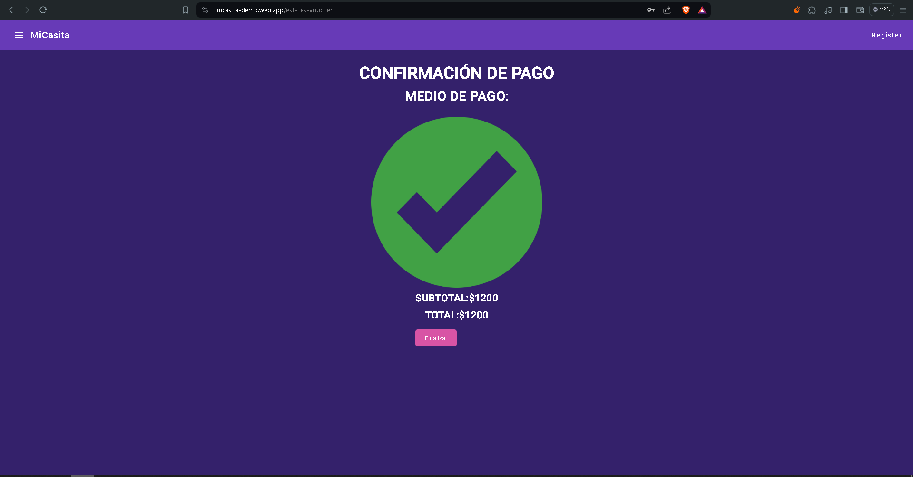

# Capítulo V: Product Implementation, Validation & Deployment

## 5.1. Software Configuration Management
En este apartado se resume todo el contenido recopilado, examinando los procedimientos a seguir y evaluando el estado emocional.
### 5.1.1. Software Development Environment Configuration
En la siguiente sección se detalla la ruta de acceso de cada uno de los productos de software, facilitando a cualquier miembro del equipo el desarrollo de cada aspecto del trabajo:
* **Visual Studio Code:** Entorno de desarrollo.\

* **HTML5:** Lenguaje de marcado para la elaboración de páginas web.\

* **CSS3:** Tecnología para dar estilo a nuestras páginas web.\

* **JavaScript:** Lenguaje de programación orientado a objetos utilizado para implementar funcionalidades en nuestra Landing Page.\

* **GitHub:** Repositorio colaborativo en la nube.\

* **GitHub Pages:** Plataforma que facilita implementar despliegues sencillos para nuestras páginas web.\

* **LucidChart:** Aplicación web dedicada a la elaboración de Wireflows, User Flows y diagramas de clases.\


* **Vertabelo:** Plataforma colaborativa para la creación de diagramas de base de datos.\

* **Figma:** Herramienta colaborativa que permite elaborar wireframes y mockups.\

### 5.1.2. Source Code Management
**Repositorio de la Landing Page:** 
**Implementación de GitFlow:**
Para nuestra estrategia de gestión de versiones con Git, nos hemos inspirado en el artículo "A successful Git branching model" de Vincent Driessen, adoptando el modelo de ramificación GitFlow. Este enfoque nos permite establecer claramente las convenciones de ramificación que aplicamos en nuestro proyecto.

* **Rama Principal (Main branch):** Contiene el código en producción y se conoce como la Master branch o Main branch.
    * Notación: main
* **Rama de Desarrollo (Develop branch):** Acumula las últimas actualizaciones y cambios para la próxima versión. Funciona como un entorno de integración y prueba continua.
    * Notación: develop
* **Rama de Lanzamiento (Release branch):** Facilita la preparación de una nueva versión del producto, permitiendo correcciones de errores y recibiendo más actualizaciones de Develop.
    * Debe derivarse de: develop
    * Debe fusionarse con: develop y master/main
    * Notación: release
* **Rama de Características (Feature branch):** Se utiliza para desarrollar nuevas funcionalidades para la siguiente versión o futuras iteraciones.
    * Debe derivarse de: develop
    * Debe fusionarse de vuelta a: develop
    * Notación: feature
* **Rama de Corrección Rápida (Hotfix branch):** Aborda errores críticos en producción, permitiendo la implementación rápida de soluciones.
    * Debe derivarse de: master/main
    * Debe fusionarse con: develop y master/main
    * Notación: hotfix

**Conventional Commits:** 
Adoptamos esta metodología para estructurar los mensajes de confirmación de cambios de manera estándar y semántica, lo que facilita la comunicación y la automatización de registros de cambios.
**Tipos de Commits Convencionales:**
* feat: Nuevas características o funcionalidades.
* fix: Correcciones de errores.
* docs: Cambios o mejoras en la documentación.
* style: Cambios de formato que no afectan la funcionalidad.
* refactor: Mejoras en la estructura o legibilidad del código.
* test: Adición o modificación de pruebas.
* chore: Cambios en el proceso de construcción o tareas de mantenimiento.
* perf: Mejoras de rendimiento en el código.
### 5.1.3. Source Code Style Guide & Conventions
En la redacción de nuestro código, hemos adoptado el uso exclusivo de la nomenclatura en inglés para todos los lenguajes mencionados.
**HTML**
* **Uso de minúsculas en elementos HTML:**
```html

<header>
  <nav>Navigation Menu</nav>
</header>
<!-- Cierre correcto de elementos HTML -->
<section>
  <article>This is an article</article>
  <article>This is another article</article>
</section>
```
* **Atributos en minúsculas:**
```html
<input type="text" placeholder="Enter your name">
```
* **Especificación de atributos para imágenes:**
```html

```
**CSS**
* **Nombres significativos para ID y clases:**
```css
#main {}
#accessForm {}
.mainButton {}
```
* **Nombres cortos y descriptivos para ID y clases:**
```css
#menu {}
.userProfile {}
Uso de propiedades abreviadas en CSS:
margin: 10px 5px;
background: url('background.jpg') no-repeat center center;
```
* **Omisión de unidades después de cero:**
```css
margin: 0;
padding: 0;
Orden alfabético en las declaraciones CSS:
.content {
  align-items: center;
  display: flex;
  justify-content: space-between;
  padding: 20px;
}
```
**JavaScript**
* **Funciones con sintaxis expandida:**
```javascript
function updateCounter() {
  // Code to update the counter
}
```
* **Nombres de variables en lowercamelCase:**
```javascript
let visitCounter = 0;
let remainingTime = 120;
```
* **Uso de let y const en lugar de var:**
```javascript
const API_URL = 'https://api.example.com';
let operationResult = sum(5, 3);
function sum(a, b) {
  return a + b;
}
```
### 5.1.4. Software Deployment Configuration
En esta sección, detallamos el proceso de implementación de nuestra landing page en la plataforma de GitHub.

1. Se crea un repositorio en GitHub para alojar el código de nuestra landing page.


2. Agregamos a los participantes:


3. Habilitamos Github Pages en la rama principal “main” y ruta “/(root)”:


4. Finalmente, se confirma el despliegue de nuestra página web después de completar todo el procedimiento.


Este proceso garantiza el despliegue satisfactorio de nuestra landing page en la plataforma de GitHub, siguiendo las especificaciones y requisitos de nuestro proyecto.
**Enlace de la Landing Page: https://homeheavenly.github.io/MiCasita/**
## 5.2. Landing Page, Services & Applications Implementation

### 5.2.1. Sprint 1 
En este informe, se documenta el progreso realizado durante la fase de definición de requisitos del proyecto, que incluye entrevistas con los stakeholders y la creación de artefactos antes y durante la implementación de la aplicación web estática. El objetivo principal es proporcionar una visión clara del avance y garantizar una comunicación efectiva entre el equipo de desarrollo y los stakeholders.

Durante esta fase, se llevaron a cabo entrevistas exhaustivas con los stakeholders para comprender sus necesidades, expectativas y requisitos específicos para la aplicación. Estas entrevistas proporcionaron información valiosa que sirvió como base para la definición de los requisitos del proyecto.

Además de las entrevistas, se realizaron actividades de creación de artefactos antes y durante la implementación de la aplicación web estática. Estos artefactos incluyeron documentos de requisitos, prototipos de diseño y especificaciones técnicas, los cuales fueron iterados y refinados en función de la retroalimentación recibida durante el proceso.

La creación de la aplicación web estática se llevó a cabo con el objetivo de proporcionar a los stakeholders una vista preliminar del producto final y recopilar sus comentarios y sugerencias para su mejora. Esta versión inicial permitió a los visitantes tener una idea clara de la dirección del proyecto y proporcionó una plataforma para la retroalimentación temprana.

#### 5.2.1.1 Sprint Planning 1


#### 5.2.1.2 Sprint  Backlog 1
| Epic / Story ID | Título | Descripción | 
|-----------------|--------|-------------|
| US001 | Página "Sobre" | Como visitante, quiero poder acceder a la página "Sobre" para obtener más información sobre la aplicación. |
| US002 | Página de Contacto | Como visitante, quiero poder acceder a la página de contacto para ponerme en contacto con el equipo de la aplicación. |
| US003 | Centro de Ayuda | Como visitante, quiero poder acceder al centro de ayuda para obtener asistencia con el uso de la aplicación. | 
| US004 | Registro de Nuevos Usuarios | Como visitante, quiero poder registrarme como usuario para acceder a todas las funcionalidades de la aplicación. |  
| US005 | Iniciar Sesión en la Aplicación | Como visitante, quiero poder acceder a mi cuenta de usuario existente para utilizar las funcionalidades de la aplicación. |  


### 5.2.2. Sprint 2
En este informe, se detallan las correcciones realizadas en el informe completo, así como los puntos a trabajar para la elaboración de la primera versión de la aplicación web front-end "Mi Casita".

Durante la revisión del informe completo, se identificaron áreas que requerían correcciones y mejoras para garantizar la calidad y coherencia del documento. Estas correcciones abarcan aspectos como la claridad en la presentación de la información, la precisión de los datos y la cohesión del contenido.

Además de las correcciones realizadas, se han designado puntos específicos para trabajar en la elaboración de la primera versión de la aplicación web front-end "Mi Casita". Estos puntos incluyen aspectos como el diseño de la interfaz de usuario, la implementación de funcionalidades clave y la optimización del rendimiento del sitio web.

#### 5.2.2.1. Sprint Planning 2.


#### 5.2.2.2. Sprint Backlog 2
| Epic / Story ID | Título | Descripción | 
|-----------------|--------|-------------|
| US006        | Crear Usuario     | Como administrador, quiero poder agregar nuevos usuarios al sistema para permitirles acceder a las funcionalidades de la plataforma. 
| US 010        | Agregar Propiedad   | Como administrador, quiero poder agregar nuevas propiedades al sistema para ampliar el catálogo de opciones para los usuarios.                                               | **Escenario 1:** Agregar propiedad exitosamente <br> **Given** el administrador completa el formulario de propiedades con información válida <br> **When** hace clic en el botón de agregar propiedad <br> **Then** la propiedad se agrega al sistema y se muestra un mensaje de éxito. <br><br> **Escenario 2:** Error al agregar propiedad <br> **Given** el administrador completa el formulario con información inválida <br> **When** hace clic en el botón de agregar propiedad <br> **Then** el sistema muestra un mensaje de error y no agrega la propiedad. | EPIC003                     |
| US014        | Búsqueda por Filtros  | Como usuario, quiero poder filtrar propiedades según diferentes criterios (precio, ubicación, tamaño, etc.) para refinar mi búsqueda.                                             | **Escenario 1:** Búsqueda exitosa con filtros <br> **Given** el usuario está en la página de búsqueda <br> **When** aplica filtros de búsqueda <br> **Then** se muestran las propiedades que coinciden con los criterios seleccionados. <br><br> **Escenario 2:** Sin resultados con filtros <br> **Given** el usuario está en la página de búsqueda <br> **When** aplica filtros de búsqueda que no tienen resultados <br> **Then** se muestra un mensaje indicando que no hay propiedades que coincidan con los criterios seleccionados. | EPIC004                    |                    |
| US018        | Reservar Cita para Ver Propiedad          | Como usuario, quiero poder reservar una cita para ver una propiedad seleccionando una fecha y hora disponibles, para confirmar mi interés en la propiedad. | **Escenario 1:** Reserva exitosa de cita <br> **Given** el usuario está en la página de detalles de la propiedad <br> **When** selecciona una fecha y hora disponibles <br> **Then** se guarda la cita en el sistema y se muestra un mensaje de confirmación. <br><br> **Escenario 2:** Error al reservar cita <br> **Given** el usuario está en la página de detalles de la propiedad <br> **When** intenta reservar una cita en una fecha y hora no disponibles <br> **Then** se muestra un mensaje de error y no se guarda la cita. | EPIC005                    |
| US006        | Crear Usuario     | Como administrador, quiero poder agregar nuevos usuarios al sistema para permitirles acceder a las funcionalidades de la plataforma.                                                  | **Escenario 1:** Creación exitosa de usuario <br> **Given** el administrador completa el formulario con datos válidos <br> **When** hace clic en el botón de crear usuario <br> **Then** el sistema crea el usuario y muestra un mensaje de éxito. <br><br> **Escenario 2:** Error en la creación de usuario <br> **Given** el administrador completa el formulario con datos inválidos <br> **When** hace clic en el botón de crear usuario <br> **Then** el sistema muestra un mensaje de error y no crea el usuario. | EPIC002                     |
| US007        | Ver Usuarios      | Como administrador, quiero poder ver una lista de todos los usuarios registrados en el sistema para supervisar la base de usuarios.                                                   | **Escenario 1:** Visualización de la lista de usuarios <br> **Given** el administrador está en la página de administración de usuarios <br> **When** accede a la lista de usuarios <br> **Then** el sistema muestra una lista de todos los usuarios registrados. <br><br> **Escenario 2:** No hay usuarios registrados <br> **Given** el administrador está en la página de administración de usuarios <br> **When** no hay usuarios registrados <br> **Then** el sistema muestra un mensaje indicando que no hay usuarios registrados. | EPIC002                    |
| US008        | Actualizar Usuario | Como administrador, quiero poder actualizar la información de un usuario existente en el sistema para corregir datos incorrectos o desactualizados.                                 | **Escenario 1:** Actualización exitosa de la información del usuario <br> **Given** el administrador está en la página de detalles del usuario <br> **When** modifica la información del usuario <br> **Then** el sistema guarda los cambios y muestra un mensaje de éxito. <br><br> **Escenario 2:** Error en la actualización de la información del usuario <br> **Given** el administrador está en la página de detalles del usuario <br> **When** intenta modificar la información del usuario con datos inválidos <br> **Then** el sistema muestra un mensaje de error y no guarda los cambios. | EPIC002                    |
| US009        | Eliminar Usuario  | Como administrador, quiero poder eliminar un usuario del sistema si ya no es necesario o si incumple las políticas de la plataforma.                                                   | **Escenario 1:** Eliminación exitosa de usuario <br> **Given** el administrador está en la página de detalles del usuario <br> **When** confirma la eliminación del usuario <br> **Then** el sistema elimina al usuario y muestra un mensaje de confirmación. <br><br> **Escenario 2:** Cancelar eliminación de usuario <br> **Given** el administrador está en la página de detalles del usuario <br> **When** cancela la eliminación del usuario <br> **Then** el sistema no elimina al usuario y vuelve a la página de detalles del usuario. | EPIC002


#### 5.2.1.3 Development Evidence for Sprint Review
<table>
    <thead>
        <tr>
            <th>Repository</th>
            <th>Branch</th>
            <th>Commit ID</th>
            <th>Commited on (Date)</th>
        </tr>
    </thead>
    <tbody>
        <tr>
            <td>HomeHeavenly/MiCasita</td>
            <td>dev</td>
            <td>feat: Add user task matrix to report</td>
            <td>Apr 28, 2024</td>
        </tr>
        <tr>
            <td>HomeHeavenly/MiCasita</td>
            <td>dev</td>
            <td>feat: Add user person to images</td>
            <td>Apr 27, 2024</td>
        </tr>
        <tr>
            <td>HomeHeavenly/MiCasita</td>
            <td>dev</td>
            <td>feat: Añadir información de entrevista sobre búsqueda de alojamiento</td>
            <td>Apr 28, 2024</td>
        </tr>
        <tr>
            <td>HomeHeavenly/MiCasita</td>
            <td>dev</td>
            <td>feat: add Impact Mapping</td>
            <td>Apr 27, 2024
</td>
        </tr>
    </tbody>
</table>

#### 5.2.1.4 Testing Suite Evidence for Sprint Review
Durante este primer sprint, hemos implementado todas las funcionalidades definidas en nuestro Sprint Backlog, asegurándonos de cumplir con sus criterios de aceptación correspondientes.\
#### 5.2.1.5 Execution Evidence for Sprint Review
Durante el primer sprint, el equipo de desarrollo de HomeHeavenly completó la creación de la Landing Page para nuestro proyecto MiCasita. En nuestro sitio web, los usuarios pueden acceder a información sobre las casas en alquiler, conocernos mejor, contactarnos, comentarios y encontrar respuestas a las preguntas más frecuentes.\



#### 5.2.1.6 Services Documentation Evidence for Sprint Review
Hasta ahora, no disponemos de documentación de nuestros servicios, ya que este primer sprint se ha centrado en el desarrollo de la Landing Page.
#### 5.2.1.7 Software Deployment Evidence for Sprint Review
Para empezar a trabajar en la implementación de la Landing Page, primero configuramos el repositorio en Github, creando las ramas principales necesarias: main, developer y features.\

Una vez establecido, cada miembro del equipo cargó su parte del proyecto al repositorio, colaborando de manera eficiente en el desarrollo.

Por último, para mostrar nuestro progreso, desplegamos el proyecto en la rama main utilizando la herramienta GitHub Pages.


#### 5.2.1.8 Team Collaboration Insights during Sprint
A lo largo del primer sprint, todos los integrantes del equipo de HomeHeavenly estuvimos comprometidos y colaboramos de manera continua en la realización de las tareas asignadas. Cada uno de nosotros demostró el avance de sus respectivas labores mediante la presentación de sus avances individuales.


## Conclusiones 

En el proyecto, la ejecución fue exitosa gracias a la coordinación eficiente entre los tres miembros del equipo. Todos contribuyeron de manera colaborativa, codificando dentro de los límites del contexto de manera satisfactoria.
## Bibliografía
1. The C4 model for visualising software architecture (2024) Recuperado de: https://c4model.com
2. Naming Conventions for java (2024) Recuperado de: https://www.oracle.com/java/technologies/javase/codeconventions-namingconventions.html#:~:text=Except%20for%20variables%2C%20all%20instance,should%20be%20short%20yet%20meaningful.
## Anexos
**Enlaces**

</center>

 |Segmento del trabajo|Link de repositorio|
|---------|---------|
| LandingPage (Anexo A)    | https://github.com/SI729-2401-WS53-Grupo-MiCasita/Documentation |
| Diagramas de clases (Anexo B)   | https://lucid.app/documents/view/c7d290c1-6d5f-4e26-b73e-cfdbba38c57a     |
| Diagramas de base de datos (Anexo C)   | https://my.vertabelo.com/doc/wrl6YNg5OsGyeUKD2zrofTFNGwBj0sOF   |
| Proyecto Anagular   |  https://github.com/SI729-2401-WS53-Grupo-MiCasita/Grupo02-Micasita-Angular-front  |


